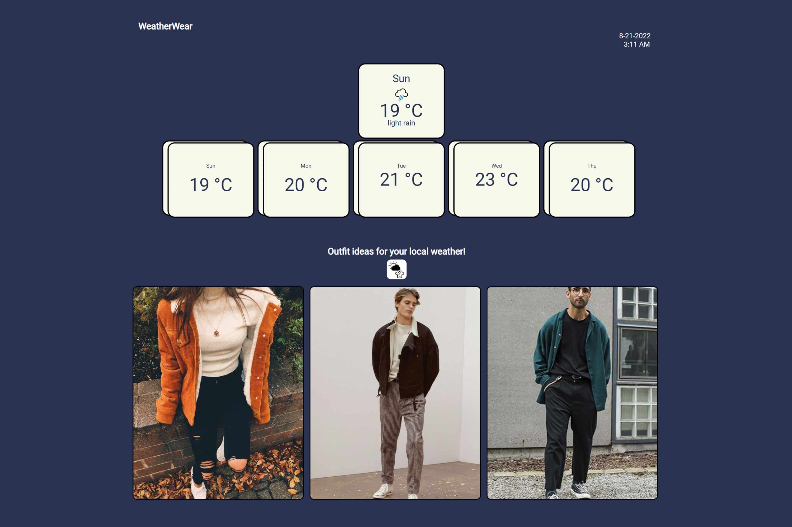

# Working-Weather-App

[WeatherWear Devpost](https://devpost.com/software/working-weather-app)

**Notice: OpenWeatherMap's API may not function correctly due to issues regarding synchronization between the key to Github's repository.**
**MUST DOWNLOAD REPOSITORY CONTENTS IN ORDER TO LAUNCH PROGRAM**

## Inspiration
Everyone is bound to run into the same problem: you can't decide what to wear! Plus, the weather is constantly changing, meaning you can never comfortably weather the same outfits all year round. Our team seeks to change that by creating an application that inspires people to look into new styles based on the local weather.

## What it does
WeatherWear is a weather forecast application that helps the user to "Get Inspired!" on outfit ideas based on the current day's forecast.

## How we built it
We used the OpenWeather API to collect data about current and future forecasts at the user’s location. When the user opens the application, they are prompted with a message asking for permission to use their location. Upon granting access, their longitude and latitude are used to pinpoint their location. The API then provides the program with the forcast data of their region in 3-hour intervals, for the next 5 days. From here, the weather temperature in Kelvin is converted into celsius (which can also be changed to Fahrenheit). Then, the is whether ID is given found in order to present a corresponding icon based on weather conditions (e.g. cloudy, snowing, rainy, etc.) Finally, the data is then analyzed to present to the user appropriate outfit ideas.

## Challenges we ran into
The main challenge we ran into was displaying the proper data from the API to our webpage. The API that we used gave us a wider quantity of information than needed. To combat this, we experimented with different methods in order to take exclusively the key pieces of information.

## Accomplishments that we're proud of
As a team, we can proudly say that learning how to use an API for the first time was a significant accomplishment for our project. In addition, we were also quite satisfied with how the aesthetics and design of the application had turned out.

## What we learned
Going into this hackathon, all of our team members had only had experience with the basics of  JavaScript, HTML, and CSS. As such, a majority of the code was learned whilst developing the application. Furthermore, we learned what APIs are and how to integrate them using JavaScript. 

## What's next for Working Weather App
Our next step to improve the WeatherWear is to get the images through a browsing tool. We would use a separate tool in order to browse sites like Pinterest and gather a greater range of content. Theoretically, the user would be able to continuously refresh the page for their next piece of outfit inspiration.

Developed by: Edwin Ngui, Davit Najaryan, Farhaan Ali

